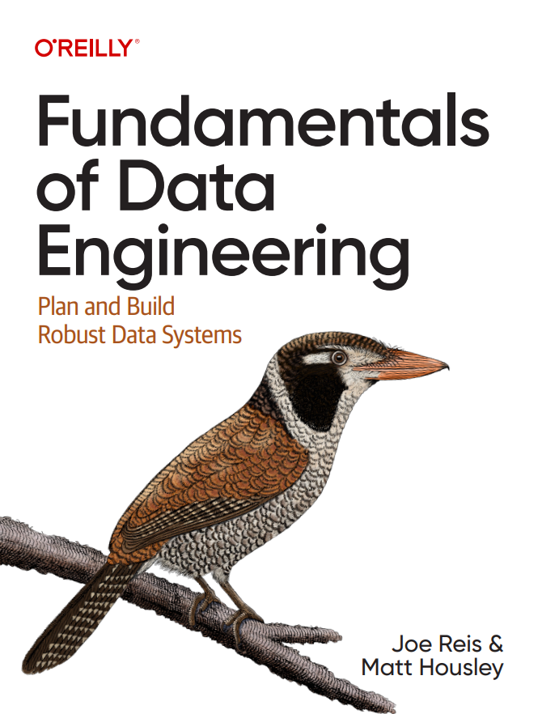

  

# Fundamentals-of-Data-Engineering

This repo contains the additional reading resources and a glossary of data engineering terms and concepts cited in the [Fundamentals of Data Engineering: Plan and Build Robust Data Systems](https://www.amazon.ca/Fundamentals-Data-Engineering-Robust-Systems/dp/1098108302) by Joe Reis & Matt Housley. 
**The purpose of this repo is to serve as a complimentary resource for ease of access when you're reading the book.
Please contact me know if you're one of the authors and want your papers' links removed. 
Please note that the hyperlink titles only include titles to make your search convenient. Please remember to cite them properly in your works. 
Please give this repo a star if you found it helpful!**

# Glossary

# Additional Reading

## Chapter 1: Data Engineering Described

- [The AI Hierarchy of Needs](https://hackernoon.com/the-ai-hierarchy-of-needs-18f111fcc007)  
- [The AlphaGo research web page](https://deepmind.google/research/alphago/)  
- [Building Analytics Teams](https://www.amazon.ca/Building-Analytics-Teams-intelligence-improvement/dp/1800203160)  
- [What is Data Engineering?](https://www.oreilly.com/library/view/what-is-data/9781492075578/ch01.html)  
- [Data as a Product vs. Data as a Service](https://readtechnically.medium.com/data-as-a-product-vs-data-as-a-service-d9f7e622dc55)  
- [Data engineering: A quick and simple definition](https://www.oreilly.com/content/data-engineering-a-quick-and-simple-definition/)  
- [Data Teams](https://www.amazon.ca/Data-Teams-Management-Successful-Data-Focused/dp/1484262271)  
- [Doing Data Science at Twitter](https://medium.com/@rchang/my-two-year-journey-as-a-data-scientist-at-twitter-f0c13298aee6)  
- [The Downfall of the Data Engineer](https://maximebeauchemin.medium.com/the-downfall-of-the-data-engineer-5bfb701e5d6b)  
- [The Future of Data Engineering is the Convergence of Disciplines](https://mode.com/blog/future-of-data-engineering-jasmine-tsai)  
- [How CEOs Can Lead a Data-Driven Culture](https://hbr.org/2020/03/how-ceos-can-lead-a-data-driven-culture)  
- [Information Management Body of Knowledge Wikipedia page](https://en.wikipedia.org/wiki/Information_Management_Body_of_Knowledge)  
- [Information management Wikipedia page](https://en.wikipedia.org/wiki/Information_management)  
- [On Complexity in Big Data](https://www.oreilly.com/radar/on-complexity-in-big-data/)  
- [OpenAI’s new language generator GPT-3 is shockingly good—and completely mindless](https://www.technologyreview.com/2020/07/20/1005454/openai-machine-learning-language-generator-gpt-3-nlp/)  
- [The Rise of the Data Engineer](https://www.freecodecamp.org/news/the-rise-of-the-data-engineer-91be18f1e603/)  
- [A Short History Of Big Data](https://datafloq.com/big-data-history/)  
- [Skills of the Data Architect](https://robertlambert.net/2012/11/skills-of-the-data-architect/)  
- [The 3 Levels of Data Analysis- A Framework for Assessing Data Organization Maturity](https://about.gitlab.com/blog/three-levels-data-analysis/)  
- [Data architect role](https://www.cio.com/article/190852/what-is-a-data-architect-its-data-framework-visionary.html)  
- [Which profession is more complex to become, a data engineer or a data scientist?](https://www.quora.com/Which-profession-is-more-complex-to-become-a-data-engineer-or-a-data-scientist)  

## Chapter 2: The Data Engineering Lifecycle

- [A comparison of data processing frameworks](https://kapernikov.com/a-comparison-of-data-processing-frameworks/)  
- [DAMA website](https://dama.org/learning-resources/dama-data-management-body-of-knowledge-dmbok/)  
- [The Dataflow Model: A Practical Approach to Balancing Correctness, Latency, and Cost in Massive-Scale, Unbounded, Out-of-Order Data Processing](https://static.googleusercontent.com/media/research.google.com/en//pubs/archive/43864.pdf)  
- [Data processing Wikipedia page](https://en.wikipedia.org/wiki/Data_processing)  
- [Data transformation Wikipedia page](https://en.wikipedia.org/wiki/Data_transformation_(computing))  
- [Democratizing Data at Airbnb](https://medium.com/airbnb-engineering/democratizing-data-at-airbnb-852d76c51770)  
- [5 steps to begin collecting the value of your data](https://www.lean-data.nl/tag/operational-metadata/)  
- [Getting started with DevOps automation](https://github.blog/enterprise-software/devops/getting-started-with-devops-automation/)  
- [Incident management in the age of DevOps](https://www.atlassian.com/incident-management/devops)  
- [An Introduction to Dagster: The orchestrator for the full data lifecycle](https://www.youtube.com/watch?v=MF5OaQEOF2E)  
- [Is DevOps Related to DataOps?](https://www.dataops.dev/dataops-vs-devops)  
- [What is incident response?](https://www.atlassian.com/incident-management/incident-response)  
- [To How To Stay Ahead of Data Debt and Downtime](https://www.secoda.co/blog/staying-ahead-of-data-debt)  
- [What Is Metadata?](https://www.dataversity.net/data-concepts/what-is-metadata/)  

## Chapter 3: Designing Good Data Architecture

- [Anemic Domain Model](https://martinfowler.com/bliki/AnemicDomainModel.html)  
- [Big data architectures](https://learn.microsoft.com/en-us/azure/architecture/databases/guide/big-data-architectures)  
- [Bounded Context](https://martinfowler.com/bliki/BoundedContext.html)  
- [The Building Blocks of a Modern Data Platform](https://towardsdatascience.com/the-building-blocks-of-a-modern-data-platform-92e46061165/)  
- [Choosing Open Wisely](https://www.snowflake.com/en/blog/choosing-open-wisely/)  
- [Choosing the Right Architecture for Global Data Distribution](https://docs.cloud.google.com/architecture/hybrid-multicloud-patterns)  
- [Data Orientation Wikipedia page](https://en.wikipedia.org/wiki/Data_orientation)  
- [A comparison of data processing frameworks](https://kapernikov.com/a-comparison-of-data-processing-frameworks/)  
- [The Cost of Cloud, a Trillion Dollar Paradox](https://a16z.com/the-cost-of-cloud-a-trillion-dollar-paradox/)  
- [The curse of the data lake monster](https://www.thoughtworks.com/insights/blog/curse-data-lake-monster)  
- [Data Architecture: A Primer for the Data Scientist](https://www.oreilly.com/library/view/data-architecture-a/9780128169179/)  
- [Data Architecture: Complex vs. Complicated](https://datalere.com/articles/data-architecture-complex-vs-complicated)  
- [Data as a Product vs. Data as a Service](https://readtechnically.medium.com/data-as-a-product-vs-data-as-a-service-d9f7e622dc55)  
- [The Data Dichotomy: Rethinking the Way We Treat Data and Services](https://www.confluent.io/blog/data-dichotomy-rethinking-the-way-we-treat-data-and-services/)  
- [Data Fabric defined](https://www.jamesserra.com/archive/2021/06/data-fabric-defined/)  
- [Data Warehouse Architecture: Overview](https://roelantvos.com/blog/enterprise_bi_architecture_overview/documentation-breakdown/)  
- [Disasters I've seen in a microservices world](https://world.hey.com/joaoqalves/disasters-i-ve-seen-in-a-microservices-world-a9137a51)  
- [Domain Driven Design](https://martinfowler.com/bliki/DomainDrivenDesign.html)  
- [Down with pipeline debt: introducing Great Expectations](https://medium.com/@expectgreatdata/down-with-pipeline-debt-introducing-great-expectations-862ddc46782a)  
- [Eager Read Derivation](https://martinfowler.com/bliki/EagerReadDerivation.html)  
- [End-To-End Serverless ETL Orchestration in AWS: A Guide](https://aws.plainenglish.io/end-to-end-serverless-etl-orchestration-in-aws-322fedd4402f)  
- [The Role of Head of Enterprise Architecture in Driving Digital Transformation](https://www.gartner.com/en/information-technology/role/enterprise-architecture-technology-leaders)  
- [Event Sourcing](https://martinfowler.com/eaaDev/EventSourcing.html)  
- [Falling Back in Love with Data Pipelines](https://devops.com/falling-back-in-love-with-data-pipelines/)  
- [5 principles for cloud-native architecture—what it is and how to master it](https://cloud.google.com/blog/products/application-development/5-principles-for-cloud-native-architecture-what-it-is-and-how-to-master-it)  
-   
-   

## Chapter 4: Choosing Technologies Across the Data Engineering Lifecycle

## Chapter 5: Data Generation in Source Systems

## Chapter 6: Storage

## Chapter 7: Ingestion

## Chapter 8: Queries, Modeling, and Transformation

## Chapter 9: Serving Data for Analytics, Machine Learning, and Reverse ETL

## Chapter 10: Security and Privacy

## Chapter 11: The Future of Data Engineering
